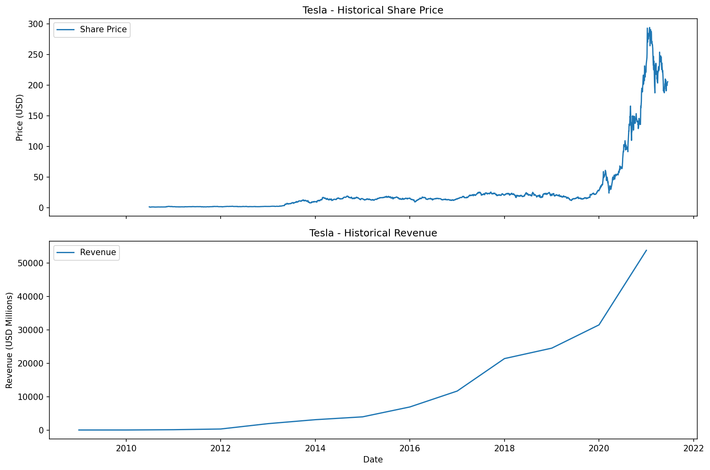

📊 Stock & Revenue Dashboard — Tesla and GameStop
🔍 Project Overview

This project analyzes historical stock prices and revenue data for Tesla (TSLA) and GameStop (GME).
It demonstrates data extraction using APIs and web scraping, data cleaning, and visualization using Python.

The goal is to showcase real-world data analysis skills, including:

API data collection

Web scraping with BeautifulSoup

Data cleaning with pandas

Time-series visualization

Dashboard-style reporting

🛠️ Tools & Technologies

Python

pandas

yfinance

requests

BeautifulSoup

matplotlib

Jupyter Notebook

📂 Project Structure
├── Revenue_Data_and_Building_a_Dashboard.ipynb
├── README.md
├── requirements.txt

📈 Key Features

Extracted historical stock price data for Tesla and GameStop using yfinance

Scraped quarterly revenue data from web sources using BeautifulSoup

Cleaned and formatted revenue and stock datasets

Built reusable visualization functions using Matplotlib

Created dashboard-style graphs comparing stock prices and revenue trends

📊 Visual Insights

Tesla shows strong growth in both stock price and revenue between 2018–2021

GameStop shows declining or stagnant revenue with highly volatile stock prices

## 📊 Dashboard Snapshots

### Tesla — Stock Price & Revenue

---

### GameStop — Stock Price & Revenue

